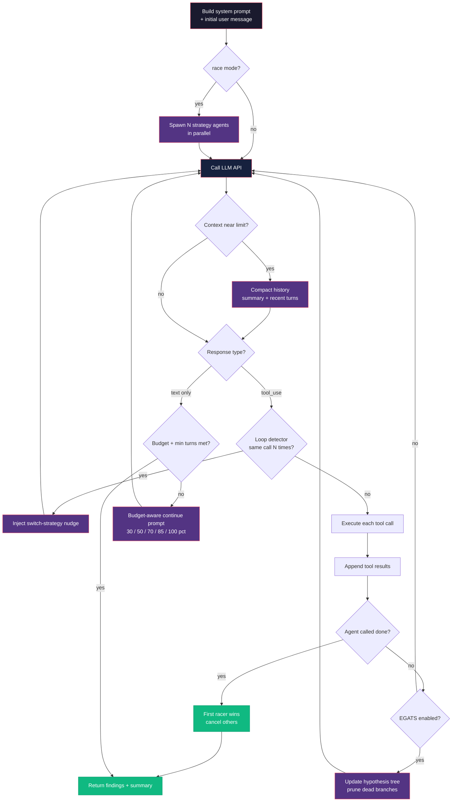

XSEC runs assessments by putting an LLM in a loop with tools. There is no
hard-coded playbook. The agent reads a system prompt, reasons, calls tools,
reads the results, and decides what to do next.

## Loop overview

The core loop is `runNativeAgentLoop` in
`packages/core/src/agent/native-loop.ts`. It uses Claude's native Messages API
with structured `tool_use` blocks rather than parsing text.



Each iteration is one **turn**. The agent has a configurable budget (`maxTurns`,
typically 15-100). The loop exits when the agent calls `done`, produces a
text-only response after enough turns, or runs out of budget.

## What the agent sees

**System prompt** — the most important input. It says what the agent is, what
tools it has, and how to approach the target. XSEC assembles a different prompt
per mode:

- `shellPentestPrompt` (web) — gives `bash`, `save_finding`, `done` and tells
  the agent to probe with curl/python3/CLI tools. No structured HTTP tools.
- `discoveryPrompt` / `attackPrompt` (LLM/AI) — probing endpoints, extracting
  system prompts, testing jailbreaks.
- `researchPrompt` (source) — map the codebase, trace input → sink, write PoCs.

The prompt includes concrete target details: URL, known endpoints, detected
features, and (for attack agents) discovery results.

**Tool results** — after each call, stdout/stderr, HTTP bodies, or structured
tool output is appended as a `tool_result` message. The agent reasons about
actual server responses, not hypothetical ones.

**Budget-aware reflection** — when the agent replies with text but no tool call
(thinking out loud instead of acting), the loop injects a continue prompt that
escalates with budget spent:

| Budget used | Prompt |
|---|---|
| < 30% | "Use your tools. Start sending requests." |
| 30-50% | "Summarize what you learned. Top hypothesis?" |
| 50-70% | "HALFWAY. List every approach tried. Most promising untested vector?" |
| 70-85% | "URGENCY. If the current approach isn't working, SWITCH NOW." |
| 85-100% | "FINAL PUSH. Highest-confidence exploit path ONLY." |

These checkpoints stop the agent from spending every turn on one dead end.

## Tool execution

`ToolExecutor` in `packages/core/src/agent/tools.ts` handles all calls. The
three that matter most for web:

- **`bash`** — runs a shell command, returns stdout/stderr. Used for everything:
  curl, Python exploits, `jq`, enumeration. `TARGET` env var is set to the
  target URL. Timeout is configurable (default 30s, max 120).
- **`save_finding`** — persists a finding (title, severity, category, evidence)
  to SQLite. It survives across stages, so the verify agent can confirm or
  reject it later.
- **`done`** — signals completion with a summary; sets `state.done = true` and
  exits.

Other tools by mode: `http_request`/`submit_form` (structured HTTP),
`send_prompt` (LLM), `read_file`/`run_command` (source), `crawl` (spidering),
`browser` (Playwright). `spawn_agent` creates one sub-agent with fresh context
to dig into a specific vuln; `spawn_agents` launches a bounded batch of such
sub-agents that run **concurrently**, each with its own turn budget. Sub-agents
can't spawn their own sub-agents.

## How it decides

The agent is an LLM — no decision trees, no hard-coded attack sequences. The
system prompt gives a framework ("recon, then auth, then attack each input"),
but the agent decides which endpoints to probe, whether a response is worth
pursuing, when to switch attack class, and how to chain findings (login →
escalate → extract). This is why shell-first works: `bash` lets the agent
compose and script in ways no fixed tool set can anticipate.

## Walk-through: IDOR exploitation

Targeting a vulnerable app at `http://target:8080`:

1. **Recon.** `curl -i http://target:8080/` returns a login form and a footer:
   "Demo credentials: demo / demo".
2. **Auth.** `curl -c /tmp/jar -b /tmp/jar -d 'username=demo&password=demo' -L
   .../login` → 302 to `/dashboard` with a session cookie.
3. **Enumerate.** `/profile` loads `/api/users/1`, showing `"id": 1, "username":
   "demo"`.
4. **IDOR probe.** `curl -b /tmp/jar .../api/users/2` returns another user:
   `"id": 2, "username": "admin", …, "flag": "FLAG{idor_1a2b3c}"`.
5. **Save + finish.** `save_finding` with the request, the leaking response, and
   analysis; then `done`.

Five turns. No playbook told it to do this — it reasoned through recon → auth →
ID-parameterized endpoint → access-control test → flag.

## Debugging

**`--verbose`** prints the full conversation: system prompt, each tool call and
args, tool results, continuation prompts, per-turn and cumulative token usage,
and the final summary and finding count.

Common patterns:

- **Loops on one payload** — budget prompts should force a switch at 50-70%. If
  it keeps repeating, the system prompt may need work.
- **"API returned empty response"** — rate limiting or model unavailability;
  check your API key and limits.
- **Exits too early** — the loop requires at least 4 turns (or `maxTurns` if
  smaller) before a text-only exit. Finishing in 2-3 turns means a premature
  `done`.
- **No findings saved** — the agent may be finding vulns but not calling
  `save_finding`. Check verbose output.

**Event log** — every tool call, error, and stage transition is logged to SQLite
(`db.logEvent`). Reconstruct a scan with:

```bash
xsec history <scan-id> --events
```

Session state is persisted every 2 turns, so interrupted scans resume with
`--resume <scan-id>`.
