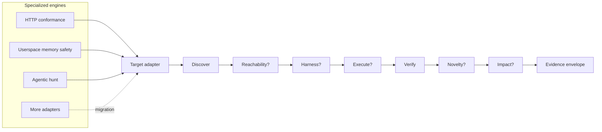
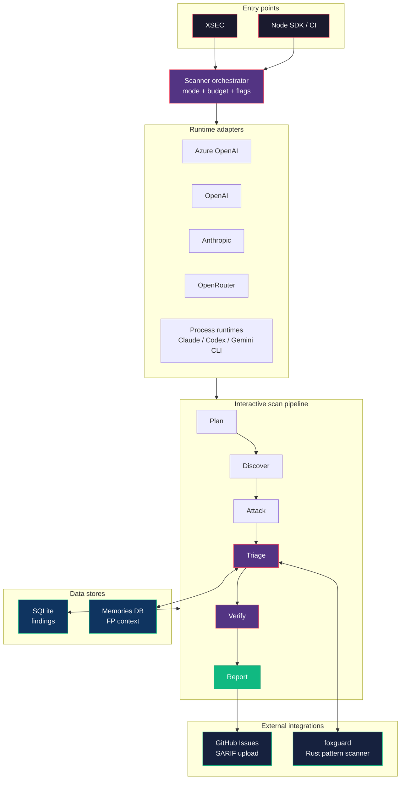

XSEC is an open cybersecurity harness built on one rule: **reproduce before
trusting.** Models propose findings; only reproducible evidence decides what is
real.

Two engines produce that evidence:

- **XSEC** runs the agentic hunt against source and live targets — repos,
  packages, web apps, AI endpoints, MCP servers. A team of agents explores in
  parallel and chains exploits together.
- **xverse** produces evidence for compiled programs when no source is
  available.



Only **discover** and **verify** are mandatory. Unsupported optional stages are
marked `skipped`; failed or unavailable proof stays `inconclusive`. Discovery
output can never promote itself.

Every result carries independent evidence dimensions:

| Dimension | Meaning |
|---|---|
| Proof grade | `candidate → reachable → observed → reproduced → impact-proven` |
| Novelty | `unchecked`, `novel`, `duplicate`, or `inconclusive` |
| Execution privilege | Linux `zero-cap`, Windows `windows-restricted`, `privileged`, or `unknown` — with an evidence basis |
| Provenance | Target/build/config identity, producer, model, attempt, run |
| Native evidence | Protocol attempts, sanitizer crashes, hunt records, VM proofs |

### Reproduced is not disclosure-ready

A reproduced result still has to clear more gates before it can be disclosed.
Disclosure requires reproduced evidence **plus** a real novelty receipt; scope,
publishability, redaction, and operator policy are all separate downstream
gates. A proof grade never implies attacker privilege.

Privilege claims carry their own attestation gates, and all of them **fail
closed**:

- **Linux zero-cap** — runtime attestation of non-root real and effective UIDs,
  an all-zero effective capability set, `no_new_privs` (so a later exec can't
  regain privilege), and a digest-bound artifact.
- **Windows LPE** — a separate token-transition gate; Linux UID/cap facts are
  never treated as Windows proof. Needs a Windows context, a retained
  token-attestation artifact and receipt, exact Canary build/campaign/worker/
  manifest binding, ≥2 target trials and ≥2 clean controls with distinct
  captures, a low/non-elevated start token, and a distinct high-integrity admin
  or LocalSystem finish token. Benchmark rows and automatic disclosure fail
  closed; human review stays mandatory.
- **Linux kernel N-of-K** — every reproduced boot supplies a bound receipt, and
  the aggregate manifest is the evidence artifact. It binds each dmesg digest
  and rejects mixed kernels or repeated boot IDs.

These are trusted-orchestrator bindings (VM kernel, guest init, launcher), not
hardware-backed attestation of a hostile worker. Human review remains
mandatory. See [Verification Results](/verification-result/) for the evidence
contract.

### Adapters

| Adapter | Native proof | Status |
|---|---|---|
| HTTP protocol conformance | Concrete request/response + deterministic RFC oracle | Connected |
| Userspace memory safety | Fuzz loop, sanitizer/Miri crash, saved input, primitive classification | Connected |
| Agentic hunt | Best-of-N records, judge, skeptic/prover, native novelty result | Connected |
| Linux kernel reproducer | Fresh-boot N-of-K signature gate with dmesg binding | Connected |
| Linux external boot matrix import | Versioned vulnerable/patched manifest, unique boot markers, clean-control gate, hashed logs | Connected; explicitly external provenance |
| Windows Hyper-V evidence import | Build/campaign/worker-bound xverse receipt, clean controls, repeated crash signature, retained dumps | Connected for crash reproduction; LPE disclosure fail-closed until token attestation |
| Mobile static intake | Typed candidates + scoped downstream handoff; no passive promotion | Connected |
| XNU IOKit | Selector discovery, reachability hints, deterministic programs; panic promotion off | Partial, fail-closed |
| Unified web/AI/source/package/on-chain pipeline | Native findings wrapped without rerunning the pipeline | Connected |

### xverse evidence engine

`xverse` is an in-repo Python evidence producer (the `xverse/` directory), not
an `@xsec/*` package. It handles compiled-program evidence with its own Ghidra,
angr, AFL++, PoV, and notary contracts. XSEC consumes only explicit, versioned
interfaces — the opt-in `xverse` binary/NDJSON contract and verified external
receipts. It never bundles xverse into `@xsec/*`, schedules it as a generic
scan worker, or promotes a hypothesis without the matching proof gate.

A shared differential runner can run identical input against two versions,
builds, configs, or implementations; a failed side is `inconclusive`, never
`divergent`. Novelty providers are pluggable per ecosystem, and zero checked
records can never produce a `novel` verdict.

Each run writes compact evidence envelopes under its artifact directory. The
research CLI emits envelope-bearing findings through the cloud sink, and the
orchestrator stores them as versioned JSONB receipts. Deduplicated retries
backfill the stronger receipt. **Legacy scans are not backfilled** — don't
assume every older finding has an envelope.

Two import paths handle kernel proofs the generic VM runner can't safely
rebuild:

- `xsec research linux-matrix` imports externally executed boots. The versioned
  manifest binds build IDs, literal crash/completion oracles, per-boot markers,
  thresholds, and log paths; XSEC hashes the manifest, every log, and its
  verdict. The envelope says `executionOrigin: external` and never claims XSEC
  ran the boots.
- `xsec research linux` runs natively, bound to a required literal crash oracle
  (`--expected-signature`). A different KASAN/oops/GPF is recorded but can't
  satisfy the N-boot gate. Each boot contributes its own hashed dmesg artifact,
  so a 2-of-3 claim carries the full three-boot audit trail.

## Interactive scan pipeline

For web pentesting the agent is shell-first: `bash` (curl, python3, sqlmap, …)
is the primary tool, not a fixed set of HTTP tools. LLM and code targets get
specialized tools like `send_prompt` and `read_file`. Raw findings pass through
triage and blind validation before they reach a report.



The pipeline has six stages grouped into two agent sessions:

```
Plan -> Discover -> Attack -> Triage -> Verify -> Report
```

### 1. Research agent (Plan + Discover + Attack + PoC)

One agent session that:

1. **Plans** — estimates difficulty, picks likely vuln classes, prioritizes
   vectors. The plan goes into the system prompt so the agent starts with a
   strategy. (Planning-before-execution is a shared trait of the strongest
   pentest agents — [KinoSec](https://kinosec.ai), [XBOW](https://xbow.com),
   [MAPTA](https://arxiv.org/abs/2508.20816).)
2. **Discovers** — maps endpoints, detects models, fingerprints tech,
   enumerates exposed paths.
3. **Attacks** — multi-turn prompt injection, jailbreaks, tool poisoning, data
   exfil (LLM); CORS, SSRF, XSS, path traversal, header injection (web); supply
   chain and malicious-code analysis (npm); vuln patterns (source).
4. **Writes PoC code** demonstrating each vulnerability.

When a scope document or challenge description exists, it's passed to the agent
as context — the same way a real pentester receives a brief.

Tool set depends on target type:

- **Web:** `bash` (primary), `browser` (Playwright headless), `save_finding`,
  `done`. Structured `crawl_page`/`submit_form`/`http_request` are optional —
  benchmarking showed the agent does better with just a shell.
- **LLM:** `send_prompt`, `bash`, `save_finding`, `done`.
- **Source/npm:** `read_file`, `search_code`, `list_files`, `run_command`,
  `save_finding`.

**Budget-aware reflection.** As the turn budget is consumed, the loop injects
escalating continue prompts (summarize → switch approach → final push) so the
agent doesn't burn all its turns on one dead end. Deep mode uses a 40-turn
budget. See [Agent Loop](/agent-loop/) for the full loop.

### 2. Triage stage

Between raw findings and the report, findings flow through a multi-layer triage
pipeline. Each layer rejects, downgrades, or confirms based on an independent
signal, and most layers are cheap deterministic checks that run before any LLM
token is spent. Full detail: [Finding Triage](/triage/).

> **EGATS caveat.** The 2026-04-11 ablation found `egatsTreeSearch` regresses
> solve rate on hard challenges at ~10× the cost of the next-worst layer. It's
> removed from the default moat aliases and opt-in only ([XSEC#116](https://github.com/uncesaii/xsec/issues/116)).
> The moat's effect is mode-dependent — a win on XBOW black-box, a Pareto
> tradeoff on white-box, a no-op on npm-bench — which is why routing is being
> learned rather than fixed ([XSEC#113](https://github.com/uncesaii/xsec/issues/113)).

### 3. Verify agent (blind validation)

The verify agent gets **only** the PoC code and file path — never the research
agent's reasoning or strategy. It independently traces data flow, tries to
reproduce, and confirms or kills the finding. If it can't reproduce, the finding
dies as a false positive. See [Blind Verification](/blind-verification/).

### 4. Report

Only confirmed findings ship. Formats: terminal (default, with share URL),
HTML, PDF, SARIF (GitHub Security tab), Markdown, JSON. Each finding carries a
severity score, category, PoC, and remediation.

## Presentation contract

Every UI and output surface consumes a renderer-neutral document or event rather
than another renderer's terminal text. The versioned contract is
`xsec.presentation/v1`: reports retain their existing schemas, while interactive
sessions use typed transcript entries and live producers emit ordered semantic
events with a local source, sequence, timestamp, type, payload, and optional scan
or session correlation.

The native OpenTUI console, plain terminal output, report formatters, and the
browser dashboard are adapters over that contract. The dashboard exposes its
same-origin live feed at `GET /api/v1/presentation/events` as Server-Sent
Events; `Last-Event-ID` resumes only persisted events after the supplied
timestamp/ID cursor. A producer's `sequence` is monotonic only within that
producer, so consumers must not infer global ordering or exactly-once delivery
across processes.

The terminal remains authoritative for an interactive console. While OpenTUI
owns stdout, direct process writes are captured as semantic records instead of
being allowed to corrupt the renderer frame; the original stream is restored
when the console exits.

## Scan modes

| Mode | Target | What it does |
|------|--------|-------------|
| `deep` | LLM API URL | Prompt injection, jailbreaks, tool poisoning, data exfil, multi-turn escalation (40-turn budget) |
| `probe` | LLM API URL | Lightweight surface scan of an LLM API |
| `web` | Web app URL | CORS, headers, exposed files, SSRF, XSS, path traversal, fingerprinting |
| `mcp` | MCP server | Tool poisoning, schema abuse, permission escalation |
| `audit` | Package or image | Supply-chain analysis, malicious-code detection, dependency risk across `npm`, `pypi`, `cargo`, `oci` |
| `review` | Local path or GitHub URL | AI source-code vulnerability analysis |

Mode is auto-detected from the target when possible, or set with `--mode`.

## Runtime adapters

XSEC decouples the pipeline from the LLM backend. Each adapter implements one
interface over a different provider:

| Adapter | Backend | How |
|---------|---------|-----|
| `ApiRuntime` | OpenRouter / Anthropic / OpenAI | Direct HTTP to the provider |
| `ClaudeRuntime` | Claude Code CLI | Spawns `claude` as a subprocess |
| `CodexRuntime` | Codex CLI | Spawns `codex` as a subprocess |
| `GeminiRuntime` | Gemini CLI | Spawns the Gemini CLI |
| `McpRuntime` | MCP servers | Connects to MCP servers |
| `AutoRuntime` | Best available | Detects installed CLIs, picks the best per stage |

`--runtime` selects the adapter; `auto` probes installed CLIs and picks the most
capable one per stage (e.g. Claude for deep reasoning, API for quick
classification).

## MCP integration

XSEC speaks MCP three ways:

- **As a client** — `McpRuntime` connects to MCP servers and uses their tools as
  the LLM backend.
- **As a server** — `xsec mcp-server` exposes a scoped subset of tools over
  stdio to an external host. `--tools` is an allowlist, not a capability grant:
  every exposed tool still runs through XSEC's execution and engagement guards,
  and XSEC keeps ownership of scope, rate limiting, persistence, and verifier
  state. External hosts (DSH, Codex, Claude Code) are optional clients; they
  don't replace the native scan loop. See
  [Improvement Plane](/improvement-plane/) for the separate future-worker
  promotion boundary.
- **As a scan target** — `--mode mcp` probes servers for tool poisoning, schema
  abuse, and permission escalation.

```bash
xsec mcp-server \
  --target https://example.com \
  --scan-id engagement-001 \
  --scope ./scope.json \
  --tools http_request,crawl,send_prompt,submit_form
```

## Product model

Two surfaces, split on purpose:

- **XSEC CLI** — the execution surface for local runs, CI, replay, exports.
- **Managed control plane** — a separate hosted product for scoped, multi-worker
  engagements (not in this repo).

Every fresh local run owns `~/.xsec/runs/<scan-id>/state.db`, its journal, and
its report. The local dashboard can inspect one run via `--db-path`; it is not a
shared worker database. Managed findings, verification state, budgets, and org
ownership live in the managed store.

## Shell-first web mode

For web pentesting, XSEC gives the agent a minimal tool set — `bash`,
`save_finding`, `done` — instead of routing it through structured tools. This
works because the model already knows curl, bash pipelines, and standard tools
from training. One `curl -c cookies.txt … | jq` replaces several structured
tool calls, and avoids the state-tracking confusion that makes agents loop.
Structured tools stay available as options; benchmarking just favored the shell.

See [Research](/research/) for the rationale and [Benchmark](/benchmark/) for
results.

## Agent tools

| Tool | Used in | Purpose |
|------|---------|---------|
| `bash` | Web, LLM, Verify | **Primary web tool.** Any shell command (curl, python3, sqlmap, nmap, …). |
| `browser` | Web | Playwright headless browser for XSS and JS-rendered pages. |
| `save_finding` | All | Record a vulnerability with PoC. |
| `done` | All | Signal completion. |
| `send_prompt` | LLM | Send prompts to AI/LLM apps. |
| `read_file` | Source, npm | Read source for code review. |
| `run_command` | Source, npm | Run an allowlisted command on the host (not a sandbox). |
| `list_files` | Source, npm | Enumerate a directory. |
| `search_code` | Source, npm | Search patterns across a codebase. |
| `crawl_page` / `submit_form` / `http_request` | Web (optional) | Structured HTTP — `bash` + curl is preferred. |
