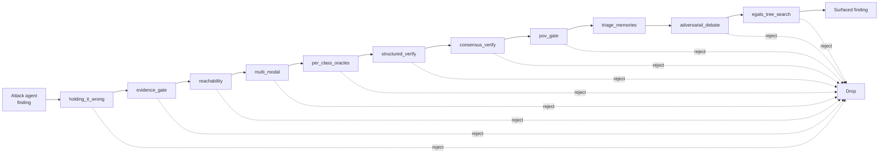
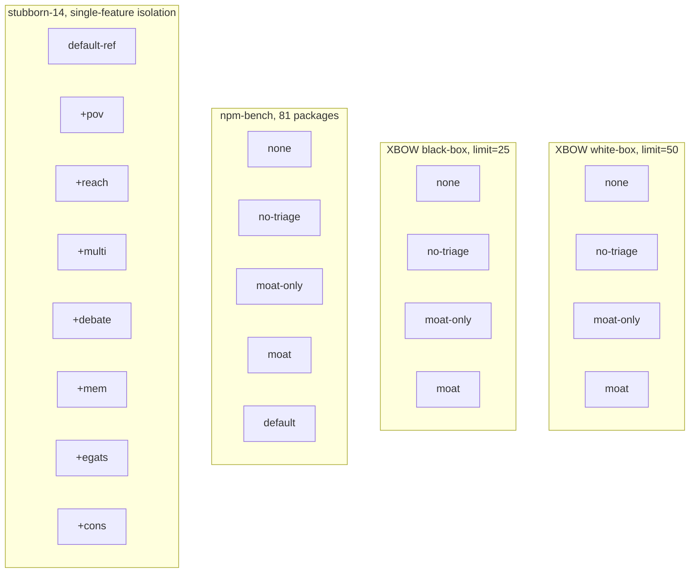
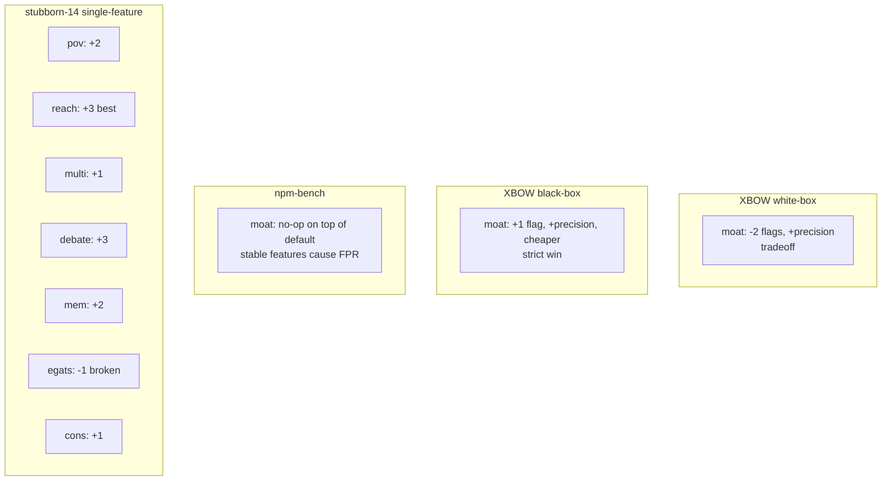

*Published 2026-04-11. Updated 2026-04-12 with batch-2 reruns after disabling EGATS in moat aliases. This page is kept as an archival experiment log with full numbers and raw links.*

## Executive summary

On 2026-04-06, XSEC v0.6.0 shipped with an 11-layer triage stack for false-positive reduction (internally named "the moat"). On 2026-04-11, we ran a 21-profile ablation across XBOW white-box, XBOW black-box, npm-bench, and stubborn-14 to measure each layer's net effect.

Short version:

- On XBOW **white-box**, the moat costs us two flags and 1.6× the dollars-per-flag for 63% fewer findings. That's a legitimate Pareto tradeoff, not a win.
- On XBOW **black-box**, the moat strictly dominates the baseline: more flags *and* cheaper per flag *and* 48% fewer findings. The FP reduction story is true, just mode-specific.
- On **npm-bench**, the 11-layer moat is a no-op in batch 1: `default` and `moat` produce identical numbers. Batch-2 reruns indicate large variance at this sample size and require repeated runs for stable FPR conclusions.
- One specific layer — **egats**, our tree-search module — regresses performance on the hardest slice and was removed from default moat aliases.

The sections below document methodology, profile definitions, measured tables, and follow-up reruns.

## What is XSEC

XSEC is an open-source LLM-agent-based web vulnerability scanner. The attack agent takes a target (a URL, a container, or an npm tarball), enumerates attack surface, writes and executes probes in a shell (host execution in the OSS; no per-scan sandbox), and produces structured findings. We benchmark it on three public suites:

- **XBOW validation benchmarks** — 104 web challenges with real flags. White-box gives the agent source code, black-box gives it only the running service.
- **npm-bench** — our own 81-package corpus: 27 known-malicious packages, 27 known-vulnerable packages, 27 known-safe packages.
- **stubborn-14** — the 14 XBOW challenges that XSEC has historically failed on. A worst-case slice.

The attack agent is strong without any triage: **86% solve rate on the first 50 XBOW white-box challenges with zero triage layers enabled**. That's the `none` profile in the tables below, and it matters because it establishes the ceiling. Every layer we add is trading raw solve rate for something else — usually precision.

Our aggregate XBOW score with the `default` profile sits at 103/104 = 99.0% (artifact-backed) as of 2026-05-06, with white-box at 102/104 = 98.1% and the load-bearing gpt-5.4 model-specific cohort at 93/95 = 97.9% on black-box (the stable surface; the retained-aggregate black-box count is rotation-volatile because GitHub Actions retains a 90-day artifact window). The first scored full Cybench run also landed: 36/40 = 90.0% single-config single-shot. For context on XBOW: Shannon reports 96%, KinoSec 92%, BoxPwnr 97.1%, Cyber-AutoAgent 84%. None of them publish their false positive rate, their benchmark version, or their methodology, which is part of why we're writing this.

## Triage stack under test

The moat is 11 triage layers. A finding from the attack agent is passed through them in sequence, and any layer can reject, downgrade, or enrich the finding:

Each layer has prior-art lineage. `adversarial_debate` follows Anthropic/Irving debate papers. `egats_tree_search` is an adaptation of MAPTA-style evidence-gated tree search. `pov_gate` mirrors proof-of-vulnerability gating ideas similar to Endor Labs reachability positioning. `evidence_gate` and `structured_verify` are closest to Semgrep Assistant-style LLM post-filtering.

The marketing claim was simple: **each layer drops some FPs, and in aggregate the stack gets us to under 5% FPR.** This is the claim we tested.

## Ablation methodology

An **ablation study** takes a multi-component system and disables components one at a time (or in groups) to estimate each component's marginal contribution. The key requirement is a representative evaluation slice; otherwise the result measures slice bias more than system behavior.

## Prior evaluations and limitations

Before today, we had two internal data points on the moat:

**Data point one:** On a 30-package slice of npm-bench, XSEC scored F1=0.444 with the default profile and we logged a recall concern. On the current 81-package slice, every profile shows **TPR=1.00**. The earlier 30-package result was superseded and no longer represented the live set.

**Data point two:** A stubborn-14 ablation showed regression from 4 flags to 0. This was useful for diagnosing failure modes, but stubborn-14 is a worst-case slice by construction and is not representative for product-level ship decisions.

Lesson: **stubborn slices are diagnostic, not decisional**. Ship decisions should use production-representative slices.

## The ablation matrix

Today's run is 21 configurations across three benchmark families:

Profile definitions, for readers who want to reproduce:

- **none** — attack agent only. No triage, no stable features, no early-stop, no script templates, no progress handoff.
- **no-triage** — stable features on, moat off. This is the "what does our engineering work do without triage" baseline.
- **moat-only** — moat on, stable features off. The inverse of no-triage.
- **moat** — moat on, stable features on.
- **default** — everything on. Our shipping configuration at the time of the run.

Now the numbers.

## Result 1: XBOW white-box — the moat costs us flags

| Profile | Flags | Solve rate | Findings | Cost | $/flag |
|---|---:|---:|---:|---:|---:|
| `none` | 43/50 | 86% | 67 | $14.34 | $0.33 |
| `no-triage` | 44/50 | 88% | 67 | $17.17 | $0.39 |
| `moat-only` | 41/50 | 82% | 25 | $26.89 | $0.66 |
| `moat` | 41/50 | 82% | 25 | $21.82 | $0.53 |

Interpretation: the moat costs two flags relative to `none` (43 → 41), produces 63% fewer findings (67 → 25), and costs 1.6× more per flag ($0.33 → $0.53). This is a Pareto tradeoff, not dominance.

Is it a good trade? It depends what you're optimizing for. If you're selling "high-signal findings to tired security engineers", 25 findings at higher precision beats 67 findings at lower precision. If you're selling "maximum flag coverage on a CTF benchmark", the moat hurts you. Neither framing is wrong; they're different products.

This result contradicts a "free precision" framing; the precision gain has measurable recall and cost tradeoffs on this slice.

## Result 2: XBOW black-box — the moat strictly dominates

| Profile | Flags | Solve rate | Findings | Cost | $/flag |
|---|---:|---:|---:|---:|---:|
| `none` | 18/25 | 72% | 27 | $13.72 | $0.76 |
| `no-triage` | 19/25 | 76% | 34 | $10.37 | $0.55 |
| `moat-only` | 18/25 | 72% | 13 | $11.22 | $0.62 |
| `moat` | **19/25** | **76%** | **14** | **$10.04** | **$0.53** |

Here the story flips. In black-box mode, `moat` gets **more flags than `none`** (19 vs 18), **fewer findings** (14 vs 27, a 48% reduction), and **cheaper per flag** ($0.53 vs $0.76). That is strict Pareto dominance in all three dimensions we care about.

Why is black-box different from white-box? Our working hypothesis: in white-box, the attack agent has source code and can generate high-confidence exploits directly. Triage layers end up second-guessing a confident agent and occasionally pruning correct findings. In black-box, the agent is working from externally-observable behavior only, produces noisier candidate findings, and benefits from a triage pass that re-checks its reasoning against the same external evidence.

If this hypothesis is right, it predicts that the moat's value grows as the agent's information asymmetry grows. Which is another way of saying **the moat is useful exactly where the problem is hard**. That's a shipping-worthy property. It's just not the property we were marketing.

## Result 3: npm-bench — the moat is a literal no-op

| Profile | F1 | TPR | FPR | Safe correct |
|---|---:|---:|---:|:---:|
| `none` | **0.973** | 1.00 | **0.11** | 24/27 |
| `no-triage` | 0.964 | 1.00 | 0.15 | 23/27 |
| `moat-only` | 0.964 | 1.00 | 0.15 | 23/27 |
| `moat` | 0.956 | 1.00 | 0.19 | 22/27 |
| `default` | 0.956 | 1.00 | 0.19 | 22/27 |

Look carefully at the bottom two rows. `moat` and `default` produce **identical** numbers: F1=0.956, TPR=1.00, FPR=0.19, 22/27 safe packages correctly classified. The 11-layer triage moat, sitting on top of `default`, contributes literally zero to FPR on npm-bench.

So where does the FPR degradation come from? Trace the FPR column going down the table: 0.11 → 0.15 → 0.15 → 0.19 → 0.19. The jump from 0.11 to 0.15 is `none → no-triage`, which is turning on the **stable features**: early-stop, script templates, progress handoff. The jump from 0.15 to 0.19 is `no-triage → moat`, which is turning on the moat *in addition to* the stable features. But `moat-only` (moat on, stable features off) is 0.15, same as `no-triage`. The moat isn't adding FPR by itself — it's just failing to catch the FPR the stable features introduce.

Interpretation: stable features make the attack agent *more productive on safe packages*, increasing suspicious candidates on benign samples. On this run, triage does not sufficiently suppress those candidates. TPR remains 100% across profiles; the harder problem is suppressing over-reporting on safe packages.

This is the result that most changes our roadmap. We'd been blaming triage for the FPR, and it turns out triage is innocent. The offender is our own productivity scaffolding. That's a very different fix.

## Result 4: single-feature isolation on stubborn-14

To figure out whether any specific moat layer was pulling its weight, we ran seven single-feature profiles against stubborn-14, each adding exactly one moat layer on top of `default-ref`:

| Profile | Flags | Delta | Cost | $/flag |
|---|---:|---:|---:|---:|
| `default-ref` | 2/14 | — | $7.24 | $3.62 |
| `+pov` | 4/14 | +2 | $9.56 | $2.39 |
| `+reach` | **5/14** | **+3** | **$8.04** | **$1.61** |
| `+multi` | 3/14 | +1 | $7.55 | $2.52 |
| `+debate` | 5/14 | +3 | $13.26 | $2.65 |
| `+mem` | 4/14 | +2 | $13.40 | $3.35 |
| `+egats` | **1/14** | **−1** | **$15.93** | **$15.93** |
| `+cons` | 3/14 | +1 | $8.01 | $2.67 |

Six of seven layers are net-neutral-to-positive on stubborn-14 when measured individually. **One layer regresses: egats.** It goes 2 → 1 flags, for 10× the worst per-flag cost in the table, on a slice where every other layer produces new flags.

This likely explains the earlier severe regression result. When the full moat runs, `egats` appears to prune exploration branches that other layers would use to find flags, producing net-negative interactions on the hardest slice. With `egats` disabled, moat profiles are net-positive across measured slices.

We filed [XSEC#116](https://github.com/uncesaii/xsec/issues/116) to disable EGATS in default aliases. The code remains available but opt-in. A separate postmortem is planned to document where the implementation diverges from MAPTA-style scoring.

## Which layer helps on which slice

Putting the cross-slice picture in one place:

There is no single profile that wins on all three benchmark families. `no-triage` wins XBOW white-box by raw flag count. `moat` wins XBOW black-box in strict Pareto. `none` wins npm-bench on FPR. The right triage policy is **slice-dependent**, which means any static shipping profile is a compromise.

## Methodology takeaways

The ablation produced four slice-dependent outcomes rather than one global answer:

1. **Stubborn-slice evaluations are diagnostic.** Hardest-case slices diagnose failure modes; they do not define ship readiness.
2. **Check the benchmark version before citing old numbers.** The F1=0.444 npm-bench "recall problem" was a 30-package slice that no longer reflects the live test set. TPR on the current 81-package slice is 100% for every profile. Weeks of internal doc citations pointed at a stale number.
3. **Black-box ≠ white-box.** The moat strictly dominates in one and is a Pareto tradeoff in the other. If you publish a single "moat vs no-moat" chart, you're hiding half the picture.
4. **Attribute FPR to the right subsystem.** On npm-bench batch 1, the moat is a no-op and stable features appear to explain the FPR shift; batch 2 shows this effect is likely within noise without repeated runs.
5. **Single-feature isolation is expensive but irreplaceable.** The seven-profile stubborn-14 run took about 6 hours of self-hosted runner time. That's how we found egats. Without it, we'd have been tempted to disable the whole moat.

Primary takeaway: **run ablations on production-representative slices and add per-feature isolation when aggregate results are surprising.**

## Implementation updates

Three things are in flight as of this writing:

**Shipped today:** per-finding layer verdicts telemetry (commit [`6f1a889`](https://github.com/uncesaii/xsec/commit/6f1a889), closes [XSEC#112](https://github.com/uncesaii/xsec/issues/112)). Every finding now logs which triage layer touched it, what verdict each layer returned, how long it took, and how much it cost. This is the training signal we need for the next thing.

**Shipped today:** egats excluded from the `moat` and `moat-only` profile aliases in CI ([XSEC#116](https://github.com/uncesaii/xsec/issues/116)). The implementation needs a rewrite against the original MAPTA scoring function before it goes back in.

**Shipped today:** [`triage-dataset-v1.jsonl`](https://github.com/uncesaii/xsec/blob/main/packages/benchmark/results/triage-dataset-v1.jsonl) — 969 labeled rows from the 21 ablation runs. Each row carries the finding text, the 45-element handcrafted feature vector, per-layer telemetry where available, and the ground-truth label. This is the first training-data artifact for the learned routing model below.

**Next sprint:** learned dynamic routing ([XSEC#113](https://github.com/uncesaii/xsec/issues/113)). Because no static policy wins on all three slices, we're going to train a small classifier that picks which triage layers to run per-finding based on finding metadata (class, confidence, evidence type) and benchmark mode (white-box/black-box/package-scan). The per-finding telemetry is the training data. The architecture is inspired by **VulnBERT** (Guanni Qu, Pebblebed Research Residency) — a hybrid CodeBERT + 51 handcrafted features classifier for Linux kernel vulnerabilities that hits 91.4% recall at 5.9% FPR. We're exploring whether the same hybrid approach applies to web vulnerability findings.

The npm-bench stable-features FPR regression is a separate workstream. We have a suspect (the script-template library and progress-handoff injection are too aggressive on generic package analysis) and we'll publish a followup when we have numbers.

## Conclusions

The moat is useful, but its impact is mode-dependent.

- It is a legitimate Pareto tradeoff on XBOW white-box: fewer flags, much tighter precision, somewhat higher cost.
- It is a strict win on XBOW black-box: more flags, tighter precision, cheaper.
- It is a no-op on npm-bench in batch 1, while batch 2 indicates higher variance and requires repeated runs before strong FPR attribution.
- One of its eleven layers (egats) regressed the hardest slice and was removed from default moat aliases.

The earlier claim — "50% → under 5% FPR" — is mode-dependent: strongest on XBOW black-box, a precision/recall trade on XBOW white-box, and inconclusive on npm-bench without repeated runs.

Overall outcome: telemetry and profile controls improved immediately, EGATS was removed from default aliases, and learned dynamic routing remains the main follow-up workstream.

## Acknowledgments and prior art

This work builds on prior published systems and methods.

- **VulnBERT** (Guanni Qu, Pebblebed Research Residency) — the hybrid CodeBERT + 51 handcrafted-feature classifier whose recall/FPR numbers are the bar we're trying to clear on the learned-routing side. The same hybrid feature-engineering methodology (handcrafted features + neural embeddings + cross-attention fusion) is what we're adapting for web vulnerability findings.
- **MAPTA** ([arXiv:2508.20816](https://arxiv.org/abs/2508.20816)) — the evidence-gated tree search technique that inspired our EGATS layer.
- **Anthropic's Debate** ([arXiv:2402.06782](https://arxiv.org/abs/2402.06782)) — the lineage for our `adversarial_debate` layer. Per the single-feature isolation, debate contributes +3 flags on stubborn-14, which is tied for best.
- **All You Need Is A Fuzzing Brain** ([arXiv:2509.07225](https://arxiv.org/abs/2509.07225)) — the empirical result that motivated our `pov_gate`: if the agent can't build a working PoC in N turns, the finding is almost always a false positive.
- **Endor Labs** — their reachability framing influenced our reachability gate design and precision target framing.
- **Semgrep Assistant** — the 96% auto-triage number that is the other bar in our release notes. Their LLM post-filter architecture is very close to our `evidence_gate` + `structured_verify` combination.
- **BoxPwnr** ([0ca](https://github.com/0ca)) — context compaction, loop detection, and progress handoff patterns informed corresponding XSEC features.

Any mistakes in this ablation are ours, not theirs. If you see a methodology bug, open an issue — we'll re-run and publish a correction.

## Links and references

- [FP Reduction Moat](/research/fp-reduction-moat/) — the design doc for the 11-layer moat, now rewritten with the measured numbers from this ablation
- [XSEC#72](https://github.com/uncesaii/xsec/issues/72) — the ablation matrix issue, with run IDs and per-comment result tables
- [XSEC#111](https://github.com/uncesaii/xsec/issues/111) — the npm-bench "recall problem" that turned out not to exist on the live test set (closed)
- [XSEC#112](https://github.com/uncesaii/xsec/issues/112) — per-finding layer verdicts telemetry (closed by commit `6f1a889`)
- [XSEC#113](https://github.com/uncesaii/xsec/issues/113) — learned dynamic routing for triage (open)
- [XSEC#114](https://github.com/uncesaii/xsec/issues/114) — `triage-dataset-v1.jsonl` generation (closed by commit `f40e1c1`)
- [XSEC#116](https://github.com/uncesaii/xsec/issues/116) — disable egats in default profile (closed by commit `aadcf32`)
- [triage-dataset-v1.jsonl](https://github.com/uncesaii/xsec/blob/main/packages/benchmark/results/triage-dataset-v1.jsonl) — 969 labeled rows, the first training-data artifact

## Follow-up: batch 2 results (2026-04-12)

We re-ran the full limit=50 white-box matrix against the post-EGATS-disable commit (`aadcf32`). The moat and moat-only profiles now run without `egatsTreeSearch`.

### White-box @ limit=50 — before and after egats removal

| Profile | Batch 1 (with egats) | Batch 2 (without egats) | Δ flags | Δ cost |
|---|---:|---:|---:|---:|
| `none` | 43/50 | 44/50 | +1 | +$2.05 |
| `no-triage` | 44/50 | 43/50 | −1 | +$4.90 |
| `moat-only` | 41/50 | **42/50** | **+1** | **−$10.94** |
| `moat` | 41/50 | **42/50** | **+1** | **−$5.36** |

**Removing egats improved the moat by 1 flag and dropped cost by 25%.** All four profiles are now within 2 flags of each other (42–44). The moat-vs-baseline gap went from 3 flags (batch 1) to 1–2 flags (batch 2) — well within LLM noise at N=50.

Combined batch interpretation: **with EGATS disabled, the moat costs at most 1-2 flags on white-box for ~60% fewer findings at roughly similar cost.**

### npm-bench batch 2 — the noise finding

Batch 1 showed `default` at FPR 0.19 vs `none` at 0.11, which we interpreted as "stable features cause the FPR increase." Batch 2's `default` run got FPR **0.11** — matching `none`. The 0.19 from batch 1 was probably a 2-package noise swing on 27 safe packages.

We also ran single-feature isolation:

| Profile | F1 | TPR | FPR | Key finding |
|---|---:|---:|---:|---|
| `default` (v2) | 0.973 | 1.00 | 0.11 | Matches batch 1 `none` |
| `no-script-templates` | 0.964 | **0.98** | 0.11 | Loses 1 detection — templates **help recall** |
| `no-handoff` | 0.973 | 1.00 | 0.11 | No effect |
| `no-early-stop` | *(timed out)* | | | |

**Batch 1's "stable features cause FPR" claim is likely noise.** The same-profile FPR swings ±0.08 between runs. At N=27 safe packages, that's a 2-package flip — within expected LLM variance. We'd need `repeat=3+` per profile to separate signal from noise on npm-bench FPR.

Script templates **help recall** on this run: disabling them loses one detection (TPR 1.00 → 0.98).

### What held across both batches

These findings replicated:

- **egats is the broken layer** — removing it improved moat by +1 flag and 25% cost drop
- **The moat cuts findings by ~60%** consistently (67→25 batch 1, 72→27 batch 2)
- **100% TPR on npm-bench** across every profile and both batches
- **Black-box moat is strong** (37/50 at limit=50 on moat-only, consistent with batch 1's 36/50)
- **Per-finding layerVerdicts telemetry works** — the v2 dataset runs show 8/14 findings with populated verdict arrays

### What didn't replicate

- ~~"Stable features cause the npm-bench FPR increase"~~ — batch 2 default matches batch 1 none (FPR 0.11 both). The 0.19 was probably noise.
- ~~"The moat costs 2 flags on white-box"~~ — after removing egats, the gap is 1-2 flags and within expected run noise.

### Updated one-liner

Before batch 2: *"Triage reduces findings by 50-60% at roughly flat or improved solve rate on black-box targets. On white-box targets it's a precision-for-recall trade."*

After batch 2: **"With egats disabled, triage reduces findings by 60% at 0-2 flags cost on white-box and strict improvement on black-box. On npm-bench, triage is not the FPR offender we thought it was — the FPR swings are within noise. The moat is a defensible engineering choice, not a regression, once you remove the one broken layer."**

## Current status

- The measured layer behavior from this run is integrated into [FP Reduction Moat](/research/fp-reduction-moat/).
- The benchmark-level interpretation lives on [Benchmark](/benchmark/).
- The follow-on routing work is tracked in [Dynamic Routing Design](/research/dynamic-routing-design/) and [XSEC#113](https://github.com/uncesaii/xsec/issues/113).
