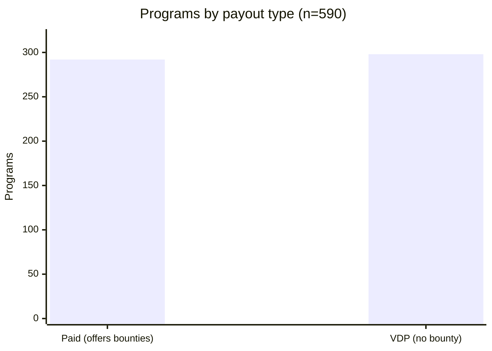
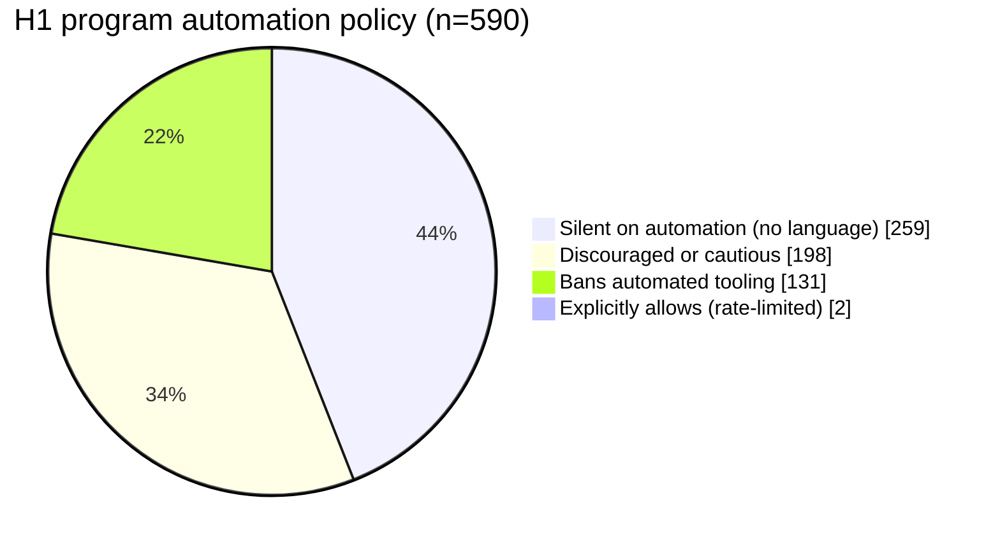
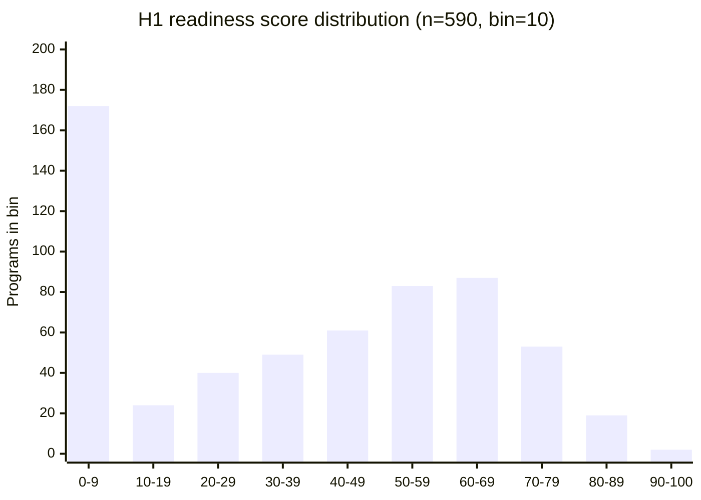
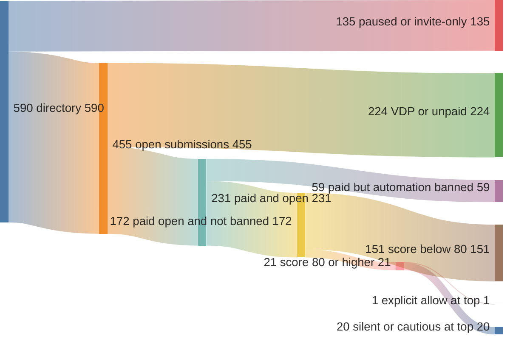
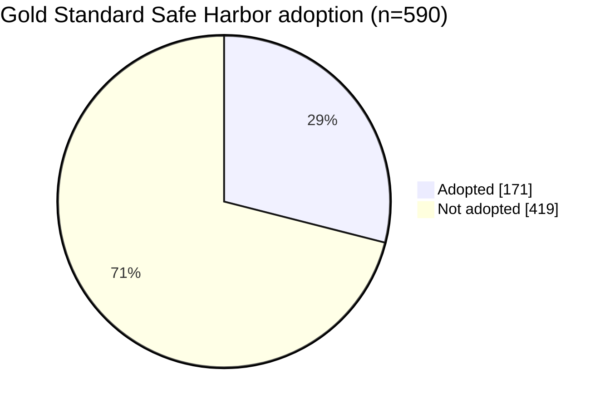

> **Historical research log (2026-05-06).** A dated lab note kept for transparency. It reflects the HackerOne policy landscape at the time and is not current legal or operational guidance.

*Published 2026-05-06. Aggregate statistics only — no program names, handles, or paraphrased identifiers appear anywhere on this page. The underlying intel is private and is never committed to the repo.*

## Lead

Autonomous pentest agents are now a recognised category — Shannon, KinoSec, BoxPwnr, XBOW Inc., and XSEC all sit somewhere between 78% and 99% on the [XBOW validation suite](https://github.com/xbow-engineering/validation-benchmarks) — and the obvious next question is where any of them can legally operate. Bug bounty is the largest standing target surface, and HackerOne is the largest single platform inside it. So we asked the only question that matters once the model can find bugs: *which programs will actually accept a report from an AI-driven pipeline without banning the researcher?* The answer turned out to be much narrower than the leaderboards imply.

## What changed in 2026

On May 11, 2026 HackerOne shipped a community-terms update that explicitly addresses AI-driven submissions ([HackerOne Code of Conduct](https://www.hackerone.com/policies/code-of-conduct), revised May 2026). Three things changed:

1. **A new "Commercial Community Member" (CCM) designation** for organisations that run automation against the platform. CCMs are bound by stricter conduct rules than individual researchers and must self-identify when their submissions are agent-generated.
2. **An AI-misuse penalty matrix.** First offence is a Final Warning. Second offence is a 12-month account suspension. Third offence is a permanent ban. The criteria for "misuse" are enumerated in the CoC and include hallucinated endpoints, missing PoCs, fabricated patches, volume-firsting (mass-submitting low-quality reports to claim priority), out-of-scope reports, and excessive traffic.
3. **A platform-wide reminder** that program-level automation policies are binding. If a policy says "no automated tools," running a scanner is a CoC violation regardless of finding quality.

The policy did not arrive in a vacuum. In late 2025 the curl project announced it would shut down its bounty programme, citing an unsustainable volume of AI-generated low-quality submissions ([The New Stack, January 2026](https://thenewstack.io/curl-bug-bounty-flooded-by-ai-slop/), [BleepingComputer, May 2025](https://www.bleepingcomputer.com/news/security/curl-project-founder-snaps-over-ai-slop-bug-reports/)). Daniel Stenberg's post described the failure mode bluntly — fabricated CVEs, invented function names, patches that referenced code that did not exist. HackerOne's update is the first major platform response. It will not be the last.

The take-away for anyone shipping an autonomous pipeline is that the *production* environment for an AI pentester is no longer just "does it find a bug." It is "does it find a bug *and* satisfy a written conduct policy *and* not poison the program for the next researcher." None of the published agent papers we have read addresses any of those three constraints.

## Audit methodology

To get a baseline on what HackerOne actually permits, we enumerated the programs visible to a logged-in researcher account via the public HackerOne API ([API documentation](https://docs.hackerone.com/en/articles/8475119-hackerone-api)). On 2026-05-06 that returned 590 programs.

For each program we fetched:

- The full program record (`/programs/<handle>`) — bounty status, submission state, Safe Harbor flag, open-scope flag, and the policy markdown.
- The structured-scopes endpoint (`/programs/<handle>/structured_scopes`) — the API-exposed asset list with type, identifier, eligibility-for-submission, and max-severity fields.

We then scored each program on six axes:

1. **Web-heavy ratio** — count of `URL` and `WILDCARD` assets divided by total scope items. Higher is better fit for a web-class agent.
2. **Bounty offered** — paid programmes weighted higher than VDPs.
3. **Submission state** — `open` weighted higher than `paused`.
4. **Automation-policy verdict** — regex classification over the policy markdown looking for terms like *automated*, *scanner*, *tool*, *fuzz*, and surrounding modifiers (*prohibited*, *not allowed*, *encouraged*, *with rate-limit*). Each program was bucketed into one of four classes: `banned`, `discouraged-or-cautious`, `silent`, or `allowed-with-rate-limit`.
5. **XSEC-strength bug-class fit** — mentions of XSS, IDOR, SSRF, RCE, or SQLi in the policy markdown.
6. **Gold Standard Safe Harbor** — the program-level flag indicating adoption of the GSSH legal-protection wording.

The aggregated scores are normalised 0–100. Anything ≥80 is what we consider "AI-tool-ready by policy." Anything ≥70 is "workable with care."

The raw data underlying this post is private competitive intel and is not republished. The numbers below are the only output.

## Aggregate findings

### Population shape

| Slice | Count | % of 590 |
|-------|-------|----------|
| Total programs visible to researcher account | 590 | 100% |
| Paid bounty | 292 | 49.5% |
| VDP only (no bounty) | 298 | 50.5% |
| Submission state: `open` | 455 | 77.1% |
| Submission state: `paused` | 135 | 22.9% |
| Gold Standard Safe Harbor adopted | 171 | 29.0% |
| Open-scope declared | 56 | 9.5% |

A few things stand out before we even get to AI policy. The paid/VDP split is roughly 50/50, contradicting the common assumption that "most HackerOne programs pay." Submission-state `paused` accounts for nearly a quarter — programs that exist on paper but cannot currently receive reports. Gold Standard Safe Harbor adoption sits at 29%; the supermajority of programs still rely on bespoke legal language with weaker researcher protections.

*Caption: paid programs and VDPs split almost exactly evenly across the public directory. The popular framing "HackerOne is a bounty platform" is half wrong — half the addressable inventory pays nothing for a valid finding, which means an automated pipeline that ignores `offers_bounties` will spend triage and verification budget on the half that cannot reciprocate.*

### Automation-policy distribution

This is the headline finding.

*Caption: the four-way split of automation policy across 590 public programs. The shock value is the bottom slice — only two programs out of 590 (0.34%) explicitly invite automated scanning. The other 99.66% either ban, discourage, or stay silent. Under the May 2026 CoC update, "silent" is not implicit consent, which means the addressable surface is closer to 200 programs at the cautious-or-allow boundary, not 590.*

| Policy verdict | Count | % of 590 |
|----------------|-------|----------|
| `banned` (explicitly prohibits automation, scanners, or fuzzing) | 131 | 22.2% |
| `discouraged-or-cautious` (rate-limit language, "please avoid," "low-volume only") | 198 | 33.6% |
| `silent` (policy makes no statement either way) | 259 | 43.9% |
| `allowed-with-rate-limit` (policy explicitly permits automation) | **2** | **0.3%** |

Two programs out of 590 explicitly allow automation. That is the upper bound on "deploy-anywhere" surface for an AI pentest agent under the current HackerOne CoC interpretation. Everything else requires reading the policy markdown carefully or accepting some level of contractual risk.

The `silent` bucket is the most interesting. Under the May 2026 CoC update, silence is *not* implicit consent — the platform-level rules still apply, and any researcher operating an automated tool against a silent program is one report-quality complaint away from a Final Warning. In practice the silent bucket is "AI-tolerable but not AI-explicit," and the operational risk depends on whether your reports look hand-crafted enough to pass triage.

### A finding on the platform itself

> **23 of 292 paid programmes (7.9%)** advertise bounties on the front page but return **zero usable in-scope assets** through the structured-scopes API endpoint. A scope-aware tool that follows the API contract will skip them entirely; a scope-blind tool that scrapes policy text will hit them and likely violate program rules. The asymmetry penalises the honest case.

The breakdown of the 23: 17 return `data: []`, 6 return only `OTHER`-type assets (no URL, no WILDCARD, no IP range). The actual scope is buried in policy markdown, parseable only by reading — so an honest agent that respects the API skips, while a less-careful tool guesses and submits. We are not naming the programmes, but the count is reproducible from any researcher account against the same endpoints. We will be filing this as a feedback item to HackerOne.

### Scoring distribution

*Caption: readiness binned by tens. Heavily left-skewed — 172 programmes (29%) score under 10, only 21 (3.6%) clear 80, and just 2 reach 90+. The bottom bin is VDPs, paused programmes, and explicit bans compounding rather than overlapping.*

| Score band | Count | % of 590 |
|------------|-------|----------|
| ≥80 (AI-tool-ready) | 21 | 3.6% |
| 70–79 (workable with care) | 53 | 9.0% |
| 60–69 | 87 | 14.7% |
| 50–59 | 83 | 14.1% |
| 40–49 | 61 | 10.3% |
| 30–39 | 49 | 8.3% |
| 20–29 | 40 | 6.8% |
| 10–19 | 24 | 4.1% |
| <10 | 172 | 29.2% |

21 programmes clear the ≥80 bar (paid + open + web-shaped + automation explicit-or-tolerant). Adding the 70–79 band brings the total to 74 (12.5%). Most of the long tail is either VDP-only, paused, non-web, or carries explicit anti-automation language.

### The funnel

*Caption: 590 → 455 open → 231 paid → 172 not-banned → 21 score 80+ → 1 explicit-allow. Five filters in sequence remove 99.8% of the directory; each one is a real check a careful tool would apply pre-submission.*

### Gold Standard Safe Harbor coverage

*Caption: 29% baseline GSSH adoption — but 20 of the 21 programmes scoring 80+ are GSSH, making it the strongest single predictor of readiness in the dataset.*

## What this means for AI agents

Three takeaways.

**1. Most programs are not AI-tool-ready by policy.** Only 0.3% of public HackerOne bounty programmes explicitly permit automated testing. The remaining 99.7% live in a spectrum from outright prohibition (22%) to ambiguous-silence (44%). A pipeline that ignores this distinction is operating in violation of platform rules across most of its addressable surface, and under the May 2026 CoC matrix the cost of a single quality complaint is a Final Warning. Two complaints inside twelve months is a year-long suspension.

**2. The aggregate AI-friendly surface is small but non-trivial.** Counting the explicit-allow plus the cautious bucket — i.e. programmes where rate-limited automation is plausibly tolerated — the addressable surface is roughly 200 programmes out of 590. Counting only programmes that also pay, are open, are web-shaped, and have non-empty structured scopes drops it to the ≥80 cohort: 21 programmes. That is the realistic deployment surface today, not 590.

**3. The platform itself has a misconfiguration tax on honest tooling.** The 23 paid-but-empty-structured-scopes finding is the kind of bug that does not show up unless you run the audit at population scale. Programmes in this state effectively penalise researchers who follow the API contract, because the API contract returns nothing usable. We are submitting this as a feedback item.

A consequence we did not expect when we started the audit: the rate-limiting effect of automation policy is much stronger than the rate-limiting effect of bug-class fit. We initially expected the gating factor to be "does this program have web assets the agent can attack." It is not. The gating factor is "does this program's policy let the agent run at all." Almost every paid programme has *some* web surface; only 21 have web surface plus a policy that lets us touch it.

## What XSEC does about it

The audit informed XSEC's submission pipeline before we have submitted a single report.

The disclose command — currently in review as [PR #206](https://github.com/uncesaii/xsec/pull/206) — implements the conduct constraints the audit surfaced as hard gates rather than soft warnings:

- **IPv6 scope-bypass fix** — the previous scope-allowlist accepted `::1` and rejected `127.0.0.1`, which is the wrong way around for HackerOne's loopback rule. Now both are normalised before allowlist check.
- **PoC-step redaction** — every reproduction-step block is run through a redactor that strips secrets, in-scope tokens, and personal data before the report markdown is generated. This is the single most common cause of the "missing PoC / hallucinated PoC" CoC violations the May 2026 update calls out.
- **Drop-could-not-run by default** — findings that the agent could not reproduce in the verifier are dropped from the disclosure bundle, not flagged. Submitting an unreproduced finding is the textbook "hallucinated endpoint" pattern.
- **Scope allowlist** — every URL referenced in a report is matched against the program's structured-scopes asset list before submission. If the asset is not in scope, the report is held, not sent.
- **Requests-per-second cap** — the verifier respects a per-program RPS cap drawn from the policy markdown. Default is 2 RPS unless the policy specifies otherwise.

Each of these maps to one or more clauses in the May 2026 CoC. None of them are research advances; they are operational hygiene. We are surfacing them here because most published agents do not appear to implement them, and because the curl outcome — an entire programme shutdown over AI slop — is what happens at the limit when nobody does.

We have not yet submitted a report from XSEC through the disclose pipeline. We will not claim a success rate before that number is real.

## Closer

The leaderboard chase has been a useful forcing function for measuring raw capability — but raw capability is now the easy half. The harder half is operating inside a written conduct framework, against scope APIs that do not always work, on a platform where 99.7% of programmes are not explicitly permissioned for automation. Reproducibility, redaction, and scope discipline are the moat now. The agent that finds the bug *and* reports it inside the rules will outlast the agent that just finds the bug. We expect the next eighteen months of the autonomous-pentest category to be decided on the second half of that sentence, not the first.

## Sources

- HackerOne Code of Conduct — <https://www.hackerone.com/policies/code-of-conduct>
- HackerOne API documentation — <https://docs.hackerone.com/en/articles/8475119-hackerone-api>
- The New Stack on the curl programme closure — <https://thenewstack.io/curl-bug-bounty-flooded-by-ai-slop/>
- BleepingComputer on AI-slop bug reports — <https://www.bleepingcomputer.com/news/security/curl-project-founder-snaps-over-ai-slop-bug-reports/>
- XSEC disclose command (PR #206) — <https://github.com/uncesaii/xsec/pull/206>
- Gold Standard Safe Harbor wording — <https://www.hackerone.com/security-compliance/gold-standard-safe-harbor>
