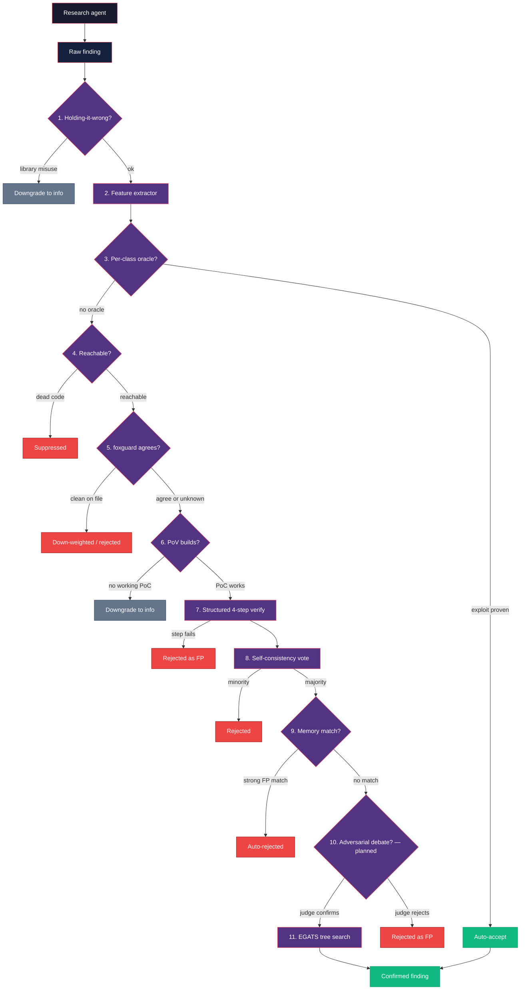

XSEC runs a triage pipeline between the research agent and the blind verify agent.
Every finding walks through a stack of independent filters; each can kill,
downgrade, or boost it. Most are deterministic, zero-cost, and run before any
verification token is spent.

> **What the ablation measured (2026-04-11).** The stack strictly beats the
> no-triage baseline on XBOW black-box, is a Pareto tradeoff on white-box (2
> flags at limit=50 for 63% fewer findings), and is a no-op on npm-bench. Layer
> 11 (EGATS) is the one broken layer and is opt-in only ([XSEC#116](https://github.com/uncesaii/xsec/issues/116)).
> Numbers: [FP Reduction Moat](/research/fp-reduction-moat/); narrative:
> [2026-04-11 ablation](/research/2026-04-11-ablation/).

## Pipeline overview



Each stage is configurable via env vars and lives under
`packages/core/src/triage/`.

## 1. Holding-it-wrong filter

`triage/holding-it-wrong.ts` — always on. Kills findings where the
"vulnerability" is the documented behavior of the sink: `fs.writeFile` as
arbitrary file write, `vm.compileFunction` as code execution, `toFunction(cb)`
as callback injection. Downgrades to `info` and skips downstream verification.

## 2. 45-feature extractor

`triage/feature-extractor.ts` — always available. Builds a 45-element numeric
vector per finding: response shape (status, size, reflection, error markers),
payload signals (encoding, sink class, parameter location), and category priors.
Handcrafted features alone hit ~77% recall / 16% FPR, and the vector feeds into
neural embeddings for downstream ML. See `FEATURE_NAMES` for the full list, or
[Feature Extractor](/research/feature-extractor/) and
[Triage Dataset](/research/triage-dataset/).

## 3. Per-class oracles

`triage/oracles.ts` — always on for supported categories. Deterministic,
category-specific verification. If the oracle proves the exploit, accept with no
LLM call.

| Category | Oracle | Proof |
|----------|--------|-------|
| SQLi | `verifySqli` | SQL error signatures + timing delta under sleep payloads |
| Reflected XSS | `verifyReflectedXss` | Unique token reflected in an executable context |
| SSRF | `verifySsrf` | Out-of-band callback (spins a local listener) |
| RCE | `verifyRce` | Command output round-trips through the response |
| Path traversal | `verifyPathTraversal` | `/etc/passwd` signature (or Windows equivalent) |
| IDOR | `verifyIdor` | Differential response across identities |

Dispatch by category with `verifyOracleByCategory(finding, target)`.

## 4. Reachability gate

`triage/reachability.ts` — `XSEC_FEATURE_REACHABILITY_GATE=1`. When source is
available, walks imports, route mounts, and framework entry points to check
whether the sink is reachable from an HTTP handler, CLI main, or user-facing
API. Dead code and test-only paths are suppressed before LLM tokens are spent.

Today it's a zero-dependency grep/pattern pass and deliberately conservative:
when it can't make a confident call it returns `reachable: true` with low
confidence so later stages still run. A tree-sitter interprocedural upgrade is
planned.

## 5. Multi-modal agreement (foxguard × XSEC)

`triage/multi-modal.ts` — `XSEC_FEATURE_MULTIMODAL=1`. When both source and the
[foxguard](https://github.com/uncesaii/foxguard) binary are present, XSEC runs
foxguard on the same code and cross-checks each finding against its SARIF:

- **Both fire on the same file/category** → auto-accept, high confidence.
- **Only XSEC fires, foxguard scanned the file cleanly** → down-weight or
  auto-reject.
- **foxguard didn't scan the file** → no signal.

```bash
env XSEC_FEATURE_MULTIMODAL=1 \
  x scan --target https://example.com --repo ./source
```

## 6. PoV generation gate

`triage/pov-gate.ts` — `XSEC_FEATURE_POV_GATE=1`. Grounded in *All You Need Is A
Fuzzing Brain* (arXiv:2509.07225): if an agent can't build a working PoC in N
turns, the finding is almost certainly a false positive.

Spins up a small, tightly-scoped agent loop with one job: build an exploit that
actually runs and returns category-specific proof. `hasPov: true` boosts
confidence and attaches the
artifact; `hasPov: false` downgrades to `info` and sets `triageNote = "no_pov"`.

## 7. Structured 4-step verify pipeline

`triage/structured-verify.ts` — default when a runtime is available. The
single-shot blind verify is split into four focused subtasks, each with
category-specific prompts:

1. **Reachability** — can external input trigger the vuln?
2. **Payload validation** — does the PoC demonstrate the claim?
3. **Impact assessment** — what's the real-world impact?
4. **Exploit confirmation** — reproduce with only the PoC and target path.

Any step failure marks the finding a false positive.

## 8. Self-consistency voting

`XSEC_FEATURE_CONSENSUS_VERIFY=1`. Runs the structured verify N times (different
seeds) and takes the majority vote via `runSelfConsistencyVerify`. Trades tokens
for confidence on ambiguous findings.

## 9. Assistant memories

`triage/memories.ts` — `XSEC_FEATURE_TRIAGE_MEMORIES=1`. Semgrep-style per-target
FP context that learns from human triage. When a user marks a finding FP (and
says why), the reason is stored as a `TriageMemory`. On later scans, memories are
injected as few-shot examples into the verify prompt, and a strong match
auto-rejects without a verify call.

Scope hierarchy: `global` (every scan), `package` (targets under a package
prefix), `target` (exact URL or path). Relevance is a token-overlap heuristic
today; an embedding ranker can replace `scoreMemory` without API changes.

```bash
# Mark a finding FP and remember why
x triage mark-fp <finding-id> --reason "test fixture, not prod"

# Add a standalone memory
x triage memory add --finding <id> --reason "sink is harmless helper" \
  --scope package --scope-value my-pkg

# List memories
x triage memory list --scope target
```

## 10. Adversarial debate

**Planned — not implemented.** There is no `triage/adversarial.ts` module and no
`XSEC_FEATURE_DEBATE` flag in the engine. The intent: a prosecutor (finding is
real) and a defender (it's an FP) argue from fresh contexts, and a skeptical
judge picks the winner — each seeing only the other's written arguments, never
the research agent's chain of thought. The design follows the open-source read of
Anthropic's debate paper (arXiv:2402.06782); the point is to keep the two agents'
errors independent.

Its goal is partly served today by the **cross-family refuter**
(`stages/hunt-cross-family.ts`, on by default on the hunt path), which forces the
refute pass onto a different model family than the finder.

## 11. EGATS — Evidence-Gated Attack Tree Search

`--egats` or `XSEC_FEATURE_EGATS=1`. Beam-search over an explicit hypothesis
tree: the agent proposes attack branches with required evidence and only expands
branches where prior evidence is observed; dead hypotheses are pruned. Highest
variance in the pipeline — use it for breadth (unknown-class vulns), not depth on
a known lead. Removed from the default aliases after the ablation ([XSEC#116](https://github.com/uncesaii/xsec/issues/116)).

## Configuration cheat-sheet

| Env var | Default | Stage |
|---------|---------|-------|
| `XSEC_FEATURE_HOLDING_IT_WRONG` | **on** | 1 |
| `XSEC_FEATURE_EVIDENCE_GATE` | **on** | 2 |
| `XSEC_FEATURE_REACHABILITY_GATE` | off | 4 |
| `XSEC_FEATURE_MULTIMODAL` | off | 5 |
| `XSEC_FEATURE_POV_GATE` | off | 6 |
| `XSEC_FEATURE_PUBLISHABILITY_GATE` | off | 6 |
| `XSEC_FEATURE_POC_GEN_STATIC` | off | 6 |
| `XSEC_FEATURE_CONSENSUS_VERIFY` | off | 8 |
| `XSEC_FEATURE_LEARNED_ROUTER` | off | router |
| `XSEC_FEATURE_DYNAMIC_TRIAGE` | off | router |

`XSEC_FEATURE_TRIAGE_MEMORIES`, `_DEBATE`, and `_EGATS` were in earlier versions
of this table but no longer exist as separate toggles — `egats` was removed from
the default aliases after the ablation ([XSEC#116](https://github.com/uncesaii/xsec/issues/116)).
See [Features](/features/) for the full env-var inventory.

## Enabling the whole moat at once

Turning the moat on is a **measurement, not an upgrade.** Its effect is
slice-dependent: a win on XBOW black-box, a 0-2 flag cost on white-box, a no-op
on npm-bench. The "~60% fewer findings" number people remember is the moat
working as intended; the flag count (the ground-truth-correct outcome) stayed
roughly flat. Enable it to re-measure, not to score better.

Every gate is off by default. `fp-moat` names the set:

```bash
x scan --features fp-moat --target https://example.com
# or, for templated CI:
env XSEC_FEATURE_PRESET=fp-moat x scan --target https://example.com
```

It expands to `REACHABILITY_GATE`, `MULTIMODAL`, `PUBLISHABILITY_GATE`,
`POV_GATE`, `POC_GEN_STATIC`, and `CONSENSUS_VERIFY`. Membership lives in
`packages/core/src/agent/feature-presets.ts` and is pinned by test.

A flag you set yourself always wins, so you can ablate one layer:

```bash
env XSEC_FEATURE_POV_GATE=0 x scan --features fp-moat …
```

The preset deliberately omits `LEARNED_ROUTER` and `DYNAMIC_TRIAGE` — those
decide which layers to *skip* per finding, so enabling them alongside the moat
would suppress the layers you're trying to measure.

## Checking which layers actually ran

Each layer records a verdict on the finding as it runs. `findings show` renders
it:

```bash
x findings show <id>
```

```
  Triage provenance:
  FP moat NOT engaged: no opt-in moat layer ran for this finding (always-on filters only)
  Layers: 3 executed, 5 skipped, 3 unrecorded | 412ms | $0.0000
    + holding_it_wrong   executed(pass) — no holding-it-wrong pattern matched
    + evidence_gate      executed(pass) — evidence_completeness=0.83 > 0.5
    - reachability       skipped(skip) — XSEC_FEATURE_REACHABILITY_GATE=0
    …
```

Three things to know:

- It's derived from verdicts stored **on the finding**, not your current shell. A
  default-scan finding reports the moat as not engaged even if you've exported
  every flag — otherwise re-reading an old finding could overstate what it went
  through.
- `skipped` ≠ `unrecorded`. `skipped` means the layer recorded that it stood
  down (with the flag or missing precondition named); `unrecorded` means no
  verdict exists at all.
- Three layers are permanently `unrecorded`: `structured_verify`, `consensus`,
  and `kernel_oracle` emit no verdict, so their execution can't be observed.
  They're listed in `UNINSTRUMENTED_LAYERS` and reported with an explicit reason,
  not quietly counted as skipped. Until that changes, they can't back an FP-moat
  claim.

## Further reading

- [Agent Loop](/agent-loop/) — how the research agent drives `bash`
- [Blind Verification](/blind-verification/) — how step 7 isolates the verify
  agent from the research agent's reasoning
- [Research: Finding Triage ML](/research/finding-triage-ml/) — the longer
  synthesis behind this pipeline
